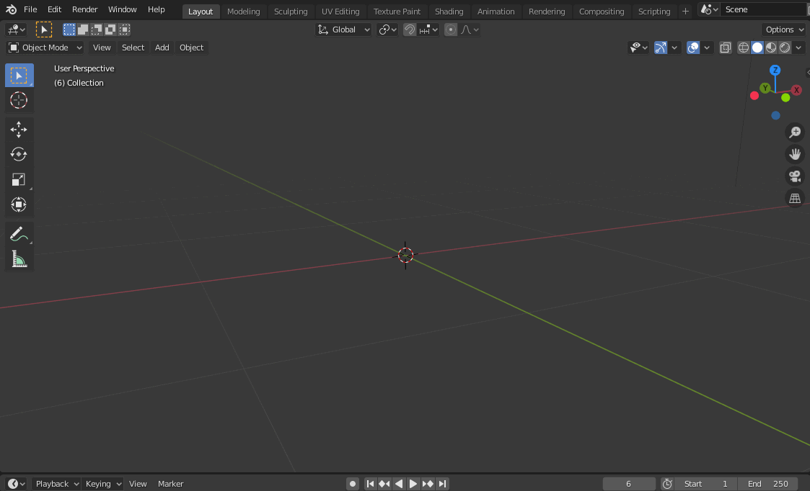
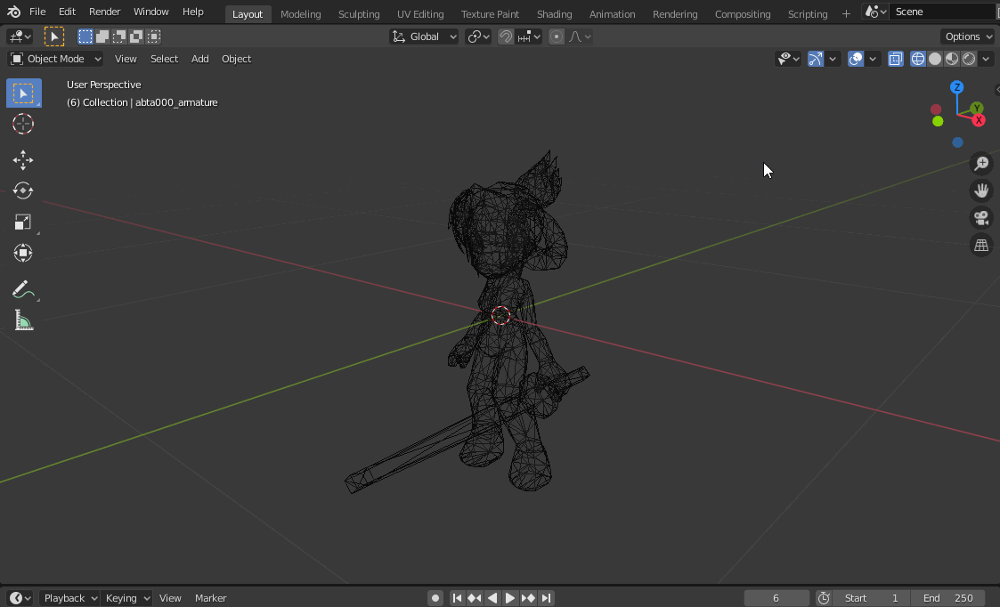
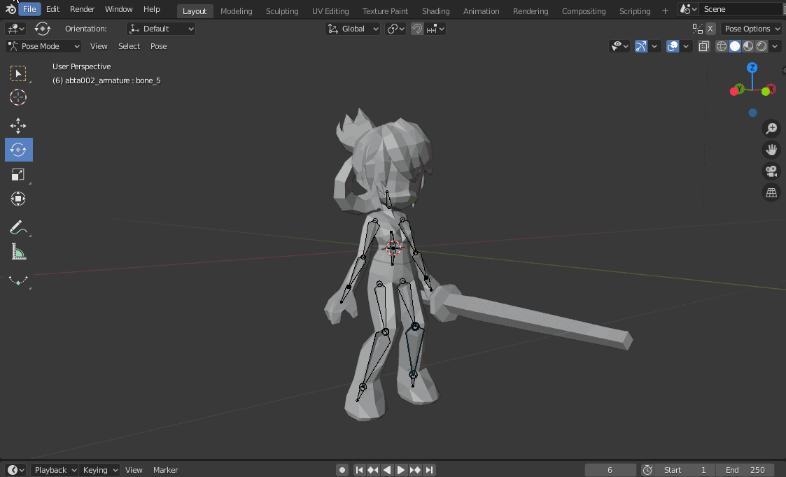
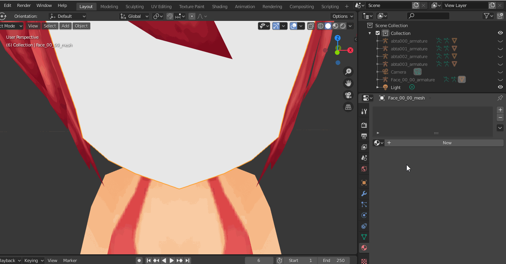
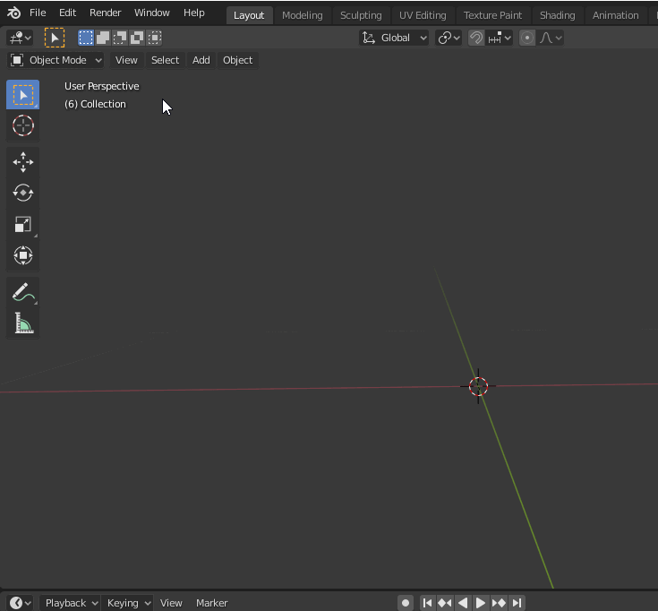
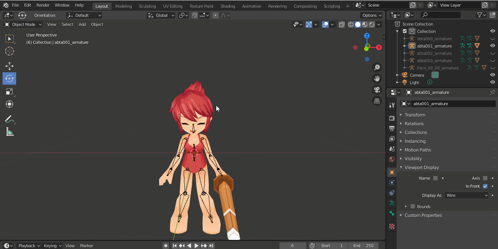
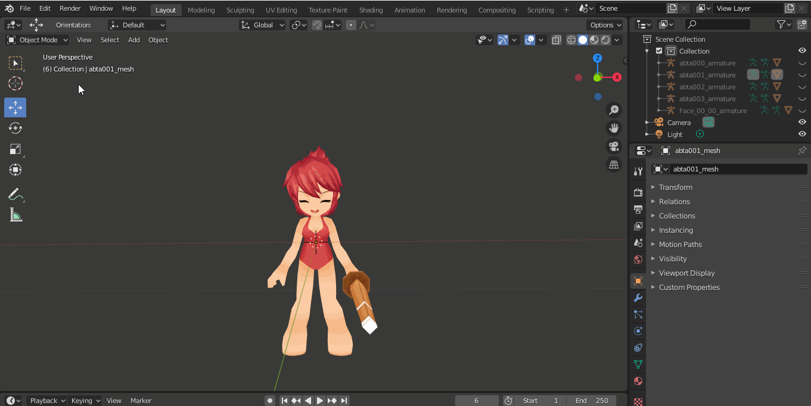

# P3M Tools
This is an add-on for importing Perfect 3D Model (.p3m) files into [Blender](https://www.blender.org/) version 2.8+.

## **Features**
Here are some key features of this add-on.

### Multi-file support
You can import multiple model files at once and save some precious time.

<p align="center">
  
</p>

### Mesh
Of course, the add-on imports the mesh of any P3M model.

<p align="center">
  
</p>

### Skeleton and Skinning
The add-on also imports all of the bones and skinning data, so that you can start animating your models immediately.

<p align="center">
  
</p>

### Texture Mapping
The add-on also imports all the data regarding UV texture mapping.

<p align="center">
  
</p>

## Installation
To install the add-on, first make sure that you have a 2.8 (or newer) [Blender installation](https://www.blender.org/download/) on your computer. After that, all you have to do is to download this repository and install the `p3m_importer.py` through Edit > Preferences > Add-ons > Install. Then, you can normally import P3M files through File > Import.

<p align="center">
  
</p>

## Important Notes
If you fiddle with the add-on for a bit, you will notice that each mesh has its own armature. The issue with that is that when you move one skeleton, the other skeletons stay the same, which is a big issue when animating characters (they have multiple meshes). See:

<p align="center">
  
</p>

To solve this, all you have to do is to select all the meshes and join them. Now, all of them share a single skeleton and you don't have to worry about this anymore.

<p align="center">
  
</p>

----
## **The P3M Format**

Perfect 3D Model file format (.p3m) is a file format that stores Grand Chase _model_ data, such as [**meshes**](https://en.wikipedia.org/wiki/Polygon_mesh) (vertexes and faces), [**skeleton** and **skinning information**](https://en.wikipedia.org/wiki/Skeletal_animation). Below, there's a _simplified_ pseudo C code that illustrates well what the P3M format looks like. 

> In order to understand how the data should be handled, I'd recommend you to take a look at the importing script in addition to the pseudocode below (although the script may look a bit messy!)

```cpp
#define INVALID_BONE_INDEX 255 // or 0xFF

struct vector_t {
    float x;
    float y;
    float z;
}; // 12 bytes

struct position_bone_t {
    vector_t position; // relative to its parent
    unsigned char children[10];
}; // 24 bytes (2-byte padding at the end of the struct)

struct file_angle_bone_t {
    // These two are not read at all
    vector_t position; // it's always 0
    float scale;

    unsigned char children[10];
}; // 28 bytes (2-byte padding at the end of the struct)

struct triangle_t {
    unsigned short point[3];
}; // 6 bytes

struct skin_vertex_t {
    vector_t position;

    // Bone weight (influence) over the vertex. It's always 1.0
    float w; 

    // Bone index used for skinning. Each vertex is always influenced by a single bone.
    // The index used during runtime is (byte)(index - bone_position_count)
    unsigned int index; 

    vector_t normal;

    // Texture coordinates (used for texture mapping)
    float tu, tv; 
}; // 40 bytes

struct vertex_t {
    vector_t position;
    vector_t normal;
    float tu, tv; 
}; // 32 bytes

struct bone_name_t {
    unsigned char index; // starts at 0
    char name[20];
}; // 21 bytes

struct p3m_file {
    char version[27];

    // Bone information
    unsigned char bone_position_count;
    unsigned char bone_angle_count;

    position_bone_t bone_positions[bone_position_count];
    file_angle_bone_t bone_angles[bone_angle_count];

    // Mesh and skinning information
    unsigned short vertex_count;
    unsigned short face_count;
    
    char texture_filename[260]; // it's always empty

    triangle_t faces[face_count];
    skin_vertex_t skin_vertices[vertex_count];

    // The data below is not read by the game
    vertex_t vertices[vertex_count];

    bone_name_t bone_positions_names[bone_position_count];
    bone_name_t bone_angles_names[bone_angle_count];
};
```
